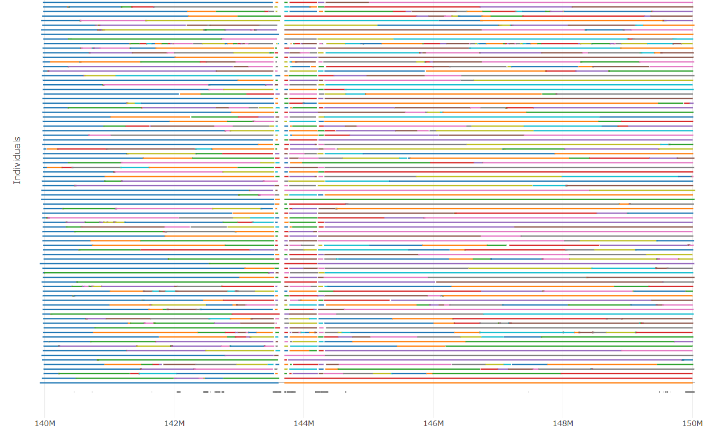

# PHASIUS

A tool to visualize phase block structure from (many) BAM, CRAM or VCF files together with BED annotation

## Installation

Download a suitable binary from [releases](https://github.com/wdecoster/phasius/releases).

Install from [bioconda](https://bioconda.github.io/recipes/phasius/README.html): `conda install phasius`

Or build with cargo: `cargo install phasius`

## Usage

```text
USAGE:
    phasius [OPTIONS] --output <OUTPUT> --region <REGION> <INPUT>...

ARGS:
    <INPUT>...    cram, bam or vcf files to check

OPTIONS:
    -r, --region <REGION>       region string to plot phase blocks from [required]
    -b, --bed <BED>             bed file annotation to use (bgzipped and tabix indexed)
    -t, --threads <THREADS>     Number of crams/bams to parse in parallel [default: 4]
    -d, --decompression <N>     Number of decompression threads to use per cram/bam [default: 1]
    -o, --output <OUTPUT>       HTML output file name
    -h, --help                  Print help information
    -V, --version               Print version information
```

## Example

  

A dynamic example can be found [here](http://phasius.bioinf.be/phasius-example.html)

## CITATION

If you use this tool, please consider citing our [publication](https://academic.oup.com/bioinformatics/article/39/5/btad311/7160911).
